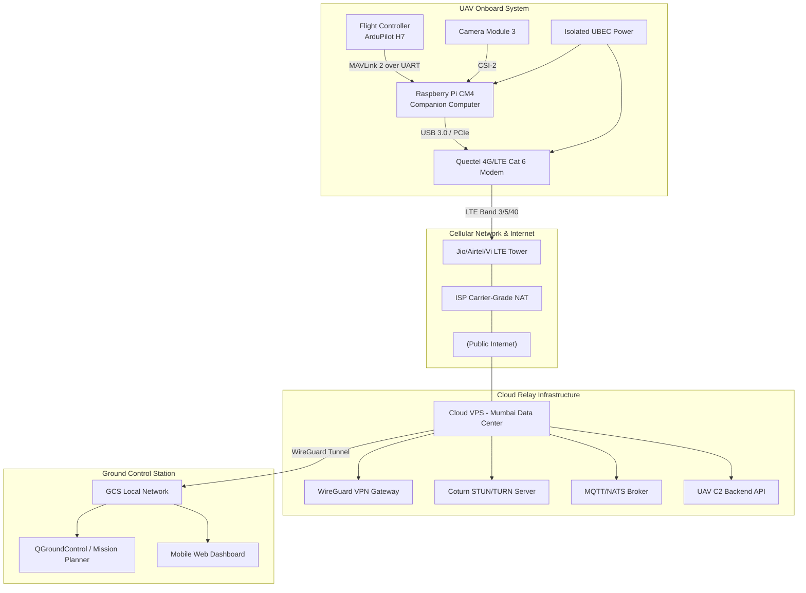
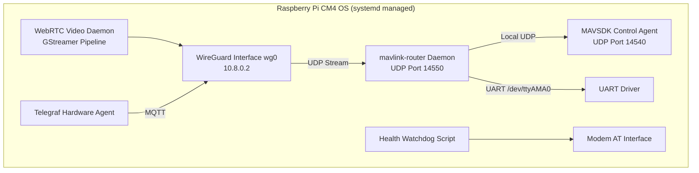
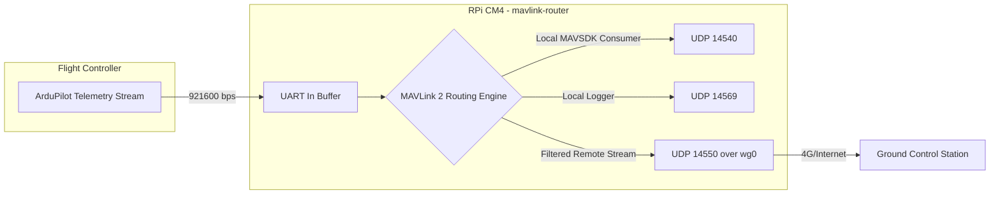
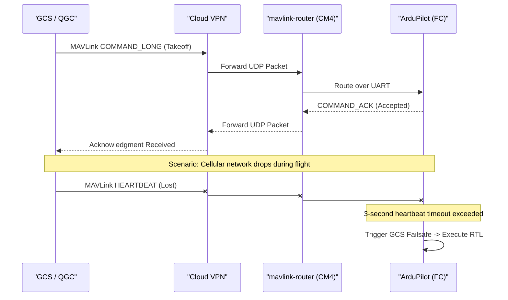
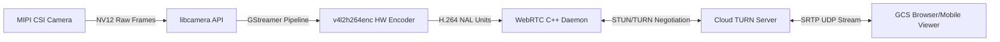
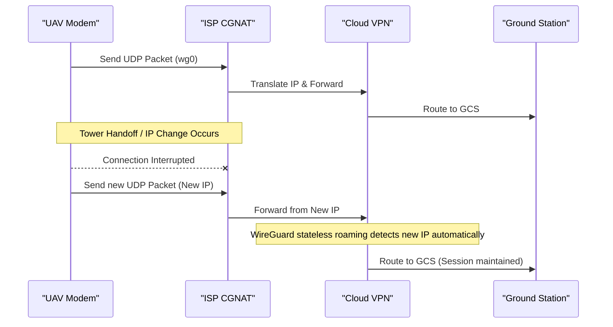

# **Long-Range UAV Design HLD**

## **Executive Summary**

The deployment of a robust, long-range Unmanned Aerial Vehicle (UAV) communication and control system over a 4G/LTE network requires a synthesis of embedded electronics, real-time networking, and resilient software architectures. Operating in environments such as Bhopal, Madhya Pradesh, introduces specific constraints: the Indian cellular landscape heavily utilizes Carrier-Grade NAT (CGNAT), experiences highly variable latency (ranging from 40 ms to over 500 ms depending on tower congestion), and is subject to intermittent thermal and geographic signal degradation. An architecture designed for this environment must treat the network as fundamentally untrusted and highly volatile.  
To achieve continuous telemetry, sub-250 ms video streaming, and secure command and control (C2), the architecture must abstract network volatility from flight-critical functions. The design strictly isolates the Flight Control Plane—managed by a dedicated hardware autopilot—from the Management, Telemetry, and Video Planes, which are managed by a companion computer. The system relies on a Raspberry Pi Compute Module 4 (CM4) acting as the companion computer, interfaced with a Pixhawk-standard H7 Flight Controller running ArduPilot. The CM4 leverages hardware-accelerated H.264 encoding and WebRTC for low-latency video, while a dedicated routing daemon (mavlink-router) handles MAVLink 2 routing over an outbound WireGuard VPN tunnel to bypass CGNAT.  
This architecture guarantees that the flight controller retains ultimate authority over stabilization and autonomous failsafe execution independent of the network state. Simultaneously, the companion computer orchestrates complex routing, hardware monitoring, cryptographic authentication, and high-bandwidth data transmission. The resulting system scales smoothly from a single experimental prototype to a geographically distributed fleet.

## **Recommended Final Architecture**

The recommended architecture is built upon a distributed intelligence model split across three primary nodes: the UAV Onboard Stack, the Cloud Relay Infrastructure, and the Ground Control Station (GCS).  
**1\. The UAV Onboard Stack:** The core of the aerial platform is a Pixhawk-standard H7-based autopilot (e.g., Cube Orange+) running ArduPilot. This flight controller is exclusively responsible for state estimation, attitude control, safety watchdogs, and mission execution1. The flight controller connects via a high-speed UART connection (baud rate 921600\) to the companion computer, a Raspberry Pi CM4. The CM4 is mounted on an industrial carrier board containing an M.2 Key-B slot housing a Quectel EM06-E (LTE Cat 6\) modem. The companion computer runs a minimal, headless Linux distribution (Raspberry Pi OS Lite 64-bit) configured with systemd to manage independent, statically compiled communication services.  
**2\. The Cloud Relay Infrastructure:**  
Because mobile network operators in India issue private IP addresses behind CGNAT, a direct connection from the ground station to the UAV is impossible. A cloud-based Virtual Private Server (VPS) located in a geographically proximate data center (such as Mumbai, to minimize fiber routing latency) serves as the rendezvous point. It hosts a WireGuard VPN server, a MAVLink routing proxy, a STUN/TURN server for WebRTC NAT traversal, and a telemetry aggregation broker. The UAV establishes a persistent outbound VPN tunnel to this server immediately upon booting, ensuring it is always reachable.  
**3\. The Ground Control Station:** The GCS comprises a laptop running QGroundControl (QGC) or Mission Planner for professional flight operations2, alongside a custom web/mobile application tailored for specific mission payloads. The GCS connects to the Cloud Relay via WireGuard, effectively placing the GCS, Cloud Server, and UAV on the same flat, encrypted virtual subnet (e.g., the 10.8.0.x range).

## **Protocol Selection Table**

To minimize latency and maximize reliability across volatile cellular links, protocol selection dictates the use of UDP-based, lightweight, and connectionless transports wherever possible, enveloped in secure tunnels. Transport Control Protocol (TCP) is explicitly avoided for time-sensitive data because packet loss on a cellular network triggers TCP retransmission and head-of-line blocking, causing unacceptable latency spikes.  
The following protocols are selected to optimize the architecture across all logical planes:

| Communication Path | Recommended Protocol | Justification |
| :---- | :---- | :---- |
| **FC ![][image1] Raspberry Pi** | MAVLink 2 (UART) | Unmatched ecosystem support, minimal overhead (12 bytes per packet)5, hardware predictability, and inherent support for MAVLink 2 signing6. UART avoids the OS-level overhead associated with USB or Ethernet adapters on the FC. |
| **Raspberry Pi ![][image1] Cloud VPS** | WireGuard (UDP) | WireGuard utilizes UDP, preventing TCP head-of-line blocking. It operates within the Linux kernel, minimizing CPU usage, and allows seamless roaming and extremely fast reconnection times when the LTE IP address changes due to cell tower handovers. |
| **Telemetry (Network)** | MAVLink 2 over UDP | UDP eliminates retransmission delays. If a telemetry packet (e.g., vehicle attitude) is lost, the next packet arrives faster than a TCP retransmission could occur, which is ideal for real-time state monitoring. |
| **Video Streaming** | WebRTC (UDP/SRTP) | Provides sub-250 ms glass-to-glass latency, adaptive bitrate, built-in congestion control, and forward error correction (FEC)7. It is vastly superior to RTSP, RTMP, or HLS over variable 4G networks. |
| **Application C2** | MAVSDK (gRPC/C++) | MAVSDK provides a highly robust, asynchronous API for custom applications without exposing raw MAVLink logic to developers, abstracting complex state machines. |
| **Hardware Monitoring** | MQTT (TCP/QoS 1\) | Health metrics (CPU, temperature, LTE signal) require guaranteed delivery over time but are not latency-critical. MQTT Quality of Service (QoS) 1 ensures delivery despite brief network outages, buffering data locally if the connection drops. |
| **Configuration Channel** | SSH over WireGuard | Provides secure, authenticated access for maintenance, debugging, and over-the-air updates without exposing the SSH port to the public internet. |
| **Emergency/Failsafe** | MAVLink 2 COMMAND\_LONG | Direct, highly prioritized UDP packet routed over the VPN, cryptographically authenticated via MAVLink 2 Message Signing to prevent spoofing or replay attacks8. |

QUIC was considered for telemetry and C2, but its implementation complexity on constrained embedded systems and reliance on TLS handshakes make it less suitable than a lightweight UDP stream secured by an underlying WireGuard tunnel. WebSockets are utilized exclusively between the Cloud API and the frontend web dashboard, but not over the cellular link itself, to avoid TCP encapsulation overhead.

## **Hardware Stack Recommendation**

The hardware stack must balance computational power, hardware encoding capabilities, thermal dissipation, and industrial reliability in a high-vibration environment.

### **Flight Controller: ArduPilot vs. PX4**

For a complex, long-range communication architecture featuring a companion computer, ArduPilot is recommended over PX4, although both are highly capable1. ArduPilot possesses an extensive suite of advanced failsafe configurations, deeper support for Lua scripting running directly on the flight controller, and more granular control over telemetry stream rates (SRx\_ parameters)1. The ArduPilot ecosystem also features a highly mature hardware abstraction layer1.  
A Pixhawk-standard controller based on the H7 microcontroller architecture (such as the Cube Orange+ or Pixhawk 6C) is required1. H7-class MCUs provide the computational headroom necessary for high-rate logging, real-time Extended Kalman Filter (EKF) estimation, and processing high-frequency MAVLink routing without starving the core attitude control loops1. Furthermore, the Cube architecture offers triple-redundant, temperature-controlled IMUs, which are vital for vibration isolation and flight safety during aggressive maneuvers or turbulent weather.

### **Companion Computer: Raspberry Pi Compute Module 4 (CM4)**

A critical evaluation of the Raspberry Pi ecosystem reveals that newer does not necessarily mean better for UAV video streaming. While the Raspberry Pi 5 offers superior raw CPU performance, it critically lacks a hardware H.264/H.265 video encoder7. Relying on the Raspberry Pi 5's software encoding (via OpenH264) introduces immense CPU load, increased power consumption, and severe thermal throttling in the enclosed, high-ambient-temperature environment of a UAV canopy7.  
Therefore, the Raspberry Pi CM4 (configured with 4GB RAM, no Wi-Fi to reduce interference, and 32GB eMMC for reliability) is the optimal choice. It features a robust V4L2 M2M hardware H.264 encoder7, allowing zero-copy direct memory access (DMA) from the camera to the encoder with near-zero CPU overhead. The CM4 must be mounted on an industrial drone-specific carrier board (e.g., from Holybro or a custom PCB) that breaks out native PCIe or USB 3.0 interfaces, multiple UARTs, and secure locking connectors (JST-GH) rather than fragile consumer USB-A ports, which are prone to vibrating loose in flight.

### **4G/LTE Modem Integration**

Consumer USB cellular dongles are notorious for overheating and experiencing thermal shutdown during continuous uplink transmission. The recommended architecture utilizes an M.2 Key-B cellular modem, specifically the Quectel EM06-E (LTE Cat 6\) or an equivalent industrial module, integrated directly onto the CM4 carrier board via USB 3.0 or PCIe. LTE Cat 6 supports Carrier Aggregation, allowing the modem to combine multiple frequency bands simultaneously, significantly improving uplink bandwidth in congested urban environments like Bhopal.  
The modem requires specialized power architecture. LTE transmitters can draw transient current spikes exceeding 2.5 Amps when negotiating with a distant cell tower. If the modem is powered directly from the Raspberry Pi’s 5V rail or the flight controller's power module, these spikes will cause instantaneous voltage sag (brownouts), rebooting the companion computer or destabilizing the avionics. The modem must be powered via a dedicated, high-quality switching Buck converter (e.g., stepping down from the flight battery to 3.3V, rated for 4A continuous output) with ample low-ESR bypass capacitance. This regulator must share a common ground with the CM4 but remain electrically isolated from the sensitive flight controller power rails.

## **Onboard Software Stack**

The software stack runs on a stripped-down Raspberry Pi OS Lite (64-bit). Heavy container orchestration platforms like Kubernetes are completely avoided due to their excessive memory overhead, constant CPU polling by the kubelet, and slow startup times. Instead, the native systemd init system manages independent, statically compiled or native binary services.

### **Core Services**

The architecture is divided into specialized, isolated services to ensure that a failure in the video pipeline does not crash the telemetry or VPN systems.

> 1. **VPN Agent:** The WireGuard kernel module establishes the secure tunnel. It is configured as a systemd service that starts before any network-dependent applications (WantedBy=network-online.target).  
> 2. **MAVLink Router Service:** mavlink-router is a highly efficient, C++ based application deployed as the central telemetry hub12. It is significantly more CPU-efficient than Python-based alternatives like MAVProxy14. It listens to the UART port and creates multiple logical UDP endpoints for local applications and the remote GCS13.  
> 3. **UAV Control API Service:** A localized application written in C++ or Rust using MAVSDK. It acts as an abstraction layer, translating high-level commands received from the cloud over a secure gRPC connection into local MAVLink commands.  
> 4. **Video Streaming Service:** A custom daemon utilizing GStreamer (libcamerasrc linked to v4l2h264enc)11 bridged into a WebRTC pipeline (e.g., using libdatachannel or MediaMTX)16.  
> 5. **Hardware Monitoring Agent:** Telegraf is used to collect system metrics (CPU, RAM, temperatures) and push them to a local MQTT broker.  
> 6. **Watchdog/Health Manager:** A high-priority bash or Python daemon that continuously monitors the health of the connection. If pings to the Cloud VPS fail for 30 consecutive seconds, it assumes a modem hang and sends AT reset commands to the Quectel module to force a hardware reconnection.

All onboard services utilize local Inter-Process Communication (IPC) via UDP localhost ports or Unix Domain Sockets. This avoids the overhead of traversing the external network stack for inter-component communication.

## **Ground Station/Mobile Stack**

The ground station ecosystem must accommodate both professional operators overseeing flight safety and downstream consumers of the data (such as payload operators or remote stakeholders).

* **Professional GCS:** A ruggedized laptop running QGroundControl (QGC) connects to the Cloud VPS via WireGuard. Because QGC natively listens on UDP port 14550 for incoming MAVLink traffic17, it receives the telemetry stream over the VPN exactly as it would over a local 900MHz radio telemetry link. The professional GCS retains ultimate authority for mission planning, parameter tuning, and complex failsafe configuration.  
* **Web/Mobile Dashboard:** For accessibility, a modern React or Next.js web application is utilized. It leverages WebRTC for ultra-low latency video rendering directly in the browser without requiring plugins7. The dashboard subscribes to telemetry over WebSockets, which are routed from a backend service on the Cloud VPS that translates raw MAVLink binary data into easily consumable JSON using tools like mavlink2rest.

## **Cloud/Relay Architecture**

The Cloud VPS acts as the authoritative routing plane, NAT traversal mechanism, and command broker. This decouples the UAV's variable IP address from the ground station.

> 1. **VPN Gateway:** WireGuard terminates tunnels from both the UAV and the GCS. It maintains static IP assignments within the tunnel (e.g., UAV is always 10.8.0.2, GCS is always 10.8.0.3). This allows the GCS to address the UAV consistently regardless of the cellular network's DHCP assignments.  
> 2. **WebRTC STUN/TURN:** An instance of Coturn is deployed. When the UAV attempts to establish a WebRTC Peer-to-Peer connection with the mobile dashboard, Coturn facilitates the STUN handshake. If the cellular CGNAT is excessively restrictive (Symmetric NAT) and prevents UDP hole punching, Coturn falls back to TURN mode, relaying the encrypted SRTP video packets through the VPS.  
> 3. **Command API Backend:** A FastAPI (Python) or Go-based backend manages user authentication via JSON Web Tokens (JWT), Role-Based Access Control (RBAC), and logs all high-level commands sent to the UAV into a PostgreSQL database for auditing purposes.

## **Telemetry Data Flow**

MAVLink routing requires careful configuration to prevent saturating the LTE uplink and overwhelming the ground station's downlink, while simultaneously serving multiple internal companion computer nodes. mavlink-router natively handles MAVLink 2 ID-based routing14.  
The Flight Controller sends a full, unfiltered telemetry stream over the high-speed UART. mavlink-router is configured via a standard .conf file with multiple distinct endpoints12:

* Endpoint 1 (UART In): /dev/ttyAMA0:921600 (Connecting to the Flight Controller).  
* Endpoint 2 (UDP Local): 127.0.0.1:14540 (Targeting the local MAVSDK application)17.  
* Endpoint 3 (UDP Remote): 10.8.0.3:14550 (Targeting the GCS over the WireGuard interface)17.  
* Endpoint 4 (UDP Local): 127.0.0.1:14569 (For local mavlink2rest or high-rate data logging)17.

**Bandwidth Optimization:** ArduPilot allows the configuration of specific stream rates via SRx\_\* parameters. Over a cellular link, non-critical telemetry must be minimized. The routing configuration requests specific intervals:

* SRx\_EXTRA1 (Attitude / IMU): 5-10 Hz (sufficient for smooth artificial horizon rendering).  
* SRx\_POSITION (GPS data): 5 Hz.  
* SRx\_EXT\_STAT (SYS\_STATUS, Battery): 1-2 Hz.  
* SRx\_PARAMS: 0 Hz (Parameters are only requested on demand by the GCS, saving immense bandwidth during flight).

mavlink-router intelligently inspects the target\_system and target\_component bytes in the MAVLink header14. If a command from the GCS targets the camera component (Component ID 100\) residing on the Raspberry Pi, mavlink-router routes it locally rather than passing it to the flight controller, strictly segregating payload control traffic from critical avionics traffic14.

## **Command and Control Data Flow**

Sending manual Remote Control (RC) commands—such as raw roll, pitch, yaw, and throttle mapped directly to joystick inputs—over a 4G connection is highly dangerous. Cellular networks experience jitter, meaning packets arrive at irregular intervals, causing command buffering. A 500 ms delay in a roll command can result in Pilot-Induced Oscillation (PIO) and catastrophic loss of the airframe.  
**Architectural Decision:** Continuous, low-latency, manual RC-style control over 4G is strictly prohibited in this design. Instead, the architecture utilizes High-Level MAVLink Commands.

* Flight operations are conducted in autonomous or semi-autonomous modes (e.g., GUIDED, AUTO, LOITER, RTL).  
* The operator commands actions like "Fly to Waypoint X," "Change Altitude to Y," or "Orbit point Z."  
* If quasi-manual control is required (e.g., nudging a camera gimbal or making minor vehicle position adjustments), the MANUAL\_CONTROL MAVLink message or velocity vectors in GUIDED mode are used, allowing the flight controller to handle the actual stabilization.

**Stale Command Handling:** The Flight Controller natively processes MAVLink sequence numbers to discard duplicate or out-of-order packets. Furthermore, a strict failsafe is configured on the FC (e.g., the FS\_GCS\_ENAB parameter in ArduPilot). If MAVLink heartbeat messages from the GCS are delayed by more than a configurable threshold (typically 3 to 5 seconds) indicating a 4G drop or heavy packet loss, the FC automatically assumes command authority, rejecting further commands until the link is stable, and transitions into LOITER or RTL (Return to Launch).

## **Video Streaming Data Flow**

Video latency is often the primary bottleneck in Beyond Visual Line of Sight (BVLOS) UAV operations. Traditional protocols are ill-suited for this task. RTSP over TCP is rejected due to head-of-line blocking; a single dropped packet stalls the entire video frame until retransmission occurs. HTTP Live Streaming (HLS) and Low-Latency HLS (LL-HLS) rely on segmenting video into files, inherently incurring multi-second latency16.  
The architecture strictly utilizes WebRTC, providing sub-250 ms glass-to-glass latency, which is essential for real-time situational awareness7. The video pipeline relies on the native libcamera API interfacing with a MIPI CSI-2 camera (e.g., the Raspberry Pi Camera Module 3).  
**Encoding Strategy:** The pipeline employs GStreamer to extract the raw NV12 frames from libcamerasrc and pass them directly into v4l2h264enc (the hardware encoder on the CM4)11.

* **Codec Selection:** The H.264 Baseline profile is selected over H.265. While H.265 offers better compression, H.264 is universally supported by mobile and browser WebRTC decoders. The baseline profile explicitly eliminates B-frames (bi-directional predictive frames), reducing encoding and decoding delay to under 15 ms.  
* **Adaptive Bitrate:** The pipeline is configured dynamically. WebRTC’s internal Google Congestion Control (GCC) algorithm monitors packet loss and RTCP Receiver Reports from the ground station. If the LTE signal degrades, the WebRTC daemon instructs the hardware encoder to drop the bitrate seamlessly from 3 Mbps down to 500 Kbps, prioritizing fluidity over image quality.  
* **Resolution and Framerate:** Target resolution is ![][image2] (720p) at 30 FPS. Pushing 1080p over unstable cellular networks yields diminishing returns and introduces stuttering.  
* **Keyframe Interval:** Forced IDR (Instantaneous Decoding Refresh) frames are generated every 1 second. High packet loss environments require frequent keyframes to quickly recover from corrupted predicted frames.

## **Hardware Monitoring Architecture**

Monitoring the state of the CM4 and LTE modem is just as vital as monitoring the flight battery. A companion computer failure in flight leaves the operator blind. The architecture implements a split-frequency telemetry model to conserve bandwidth while ensuring diagnostic visibility.  
**Low-Frequency System Metrics (1 Hz to 0.1 Hz):**  
A Telegraf agent runs on the CM4, utilizing native Linux tools to gather telemetry:

* vcgencmd measure\_temp captures the Broadcom SoC CPU/GPU temperature, critical for detecting thermal throttling.  
* /proc/stat and /proc/meminfo track CPU and RAM utilization.  
* mmcli or Modem AT Commands (e.g., AT+CSQ, AT+QENG="servingcell") extract exact RF metrics: RSRP (Reference Signal Received Power), RSRQ (Reference Signal Received Quality), SINR, and the active cellular band.  
* ping statistics track packet loss and Round-Trip Time (RTT) to the Cloud VPS.

Telegraf aggregates these metrics and publishes them to a local Mosquitto MQTT broker. A lightweight MQTT bridge forwards this data over the WireGuard tunnel to the Cloud VPS, where it is ingested into a TimescaleDB instance and visualized via a Grafana dashboard. If the LTE link drops, the local MQTT broker automatically buffers the Quality of Service (QoS) 1 messages. Upon reconnection, it delivers a burst of historical health data, providing critical post-flight diagnostic insights into exactly when and why the network failed.

## **Network and NAT Traversal Strategy**

Mobile operators in India (Jio, Airtel, Vi) utilize CGNAT to conserve IPv4 addresses. The UAV's modem receives a private IP (e.g., 10.x.x.x) and therefore cannot accept incoming connections.  
**VPN Architecture:** WireGuard is chosen over ZeroTier or Tailscale. While Tailscale provides an excellent, user-friendly mesh, it utilizes a userspace implementation (WireGuard-Go), which introduces measurable CPU overhead and context-switching latency. WireGuard operates natively in the Linux kernel, consuming negligible CPU on the CM4.  
To overcome CGNAT, the UAV initiates an outbound connection to the Cloud VPS's public IP over UDP port 51820\. The PersistentKeepalive parameter in the WireGuard configuration is set to 25 seconds. This forces the UAV to transmit a tiny, encrypted UDP ping, ensuring the ISP's CGNAT translation tables remain open, maintaining a bidirectional path.  
**Temporary Outage and IP Flapping:** As the UAV travels over long distances, the modem hands off between cell towers, momentarily losing signal or fundamentally changing its underlying CGNAT IP address. WireGuard is stateless and cryptographically handles roaming seamlessly. As soon as the modem re-establishes a cellular IP and sends a single packet, the Cloud VPS updates the endpoint mapping instantly. This restores the MAVLink and Video streams without the need to renegotiate a TCP handshake or TLS session, drastically reducing reconnection time from seconds to milliseconds.

## **Security Architecture**

Assuming the 4G network and the broader internet are intrinsically hostile, the system implements a defense-in-depth model with strict logical separation.

> 1. **Network Layer Security:** All traffic traversing the Internet is encrypted via WireGuard utilizing modern cryptography (ChaCha20-Poly1305). An attacker sniffing the 4G network sees only opaque, indistinguishable UDP packets.  
> 2. **MAVLink 2 Message Signing:** A compromised VPN (e.g., a stolen GCS laptop) must not automatically grant control over the UAV. MAVLink 2 Message Signing is strictly enforced on the Flight Controller6. A 32-byte secret key is generated, flashed onto the flight controller via a secure USB connection (using the SETUP\_SIGNING message), and securely stored in the GCS6. Every control message includes a cryptographic signature and an incrementing timestamp. The flight controller rejects any unsigned message, or any message with a timestamp older than the previous valid message, completely neutralizing replay attacks and unauthorized control6.  
> 3. **Authentication & RBAC:** The Web Dashboard API enforces JWT-based authentication. Users are divided logically into *Observers* (who possess read-only access to telemetry and the video feed) and *Pilots* (who are cryptographically authorized to issue MAVLink commands).  
> 4. **Host Security:** The Raspberry Pi OS exposes absolutely no public ports. SSH is restricted to key-based authentication only, and the SSH daemon is configured to listen exclusively on the WireGuard interface (10.8.0.2), never on the cellular wwan0 interface. Unattended security upgrades are enabled on the OS.

## **Failure and Failsafe Analysis**

The architecture anticipates and actively manages complex failure states through layered, hierarchical fallbacks.

| Failure Mode | Detection Mechanism | Expected / Fallback Behavior | Recovery Mechanism |
| :---- | :---- | :---- | :---- |
| **Loss of 4G Connectivity** | FC detects missing GCS Heartbeats for \> 3s. | FC independently enters LOITER (hovering). If connection is not restored in 10s, FC executes autonomous RTL. | VPN automatically reconnects when cellular signal returns; operator regains control. |
| **High Network Latency/Jitter** | WebRTC GCC / MAVLink ping delay calculations. | Video pipeline dynamically degrades bitrate. High-level commands remain unaffected, but manual control is disallowed. | Bitrate scales back up as RSRP/RSRQ values improve. |
| **Raspberry Pi Crash/Reboot** | FC detects complete loss of UART traffic. | FC treats this as a total GCS loss. Enters RTL. The RPi relies on a hardware watchdog timer (/dev/watchdog) to force a hard reboot if the kernel panics. | RPi boots, establishes VPN, and resumes telemetry routing automatically. |
| **LTE Modem Crash** | Watchdog script detects ping failure \> 30s to VPS. | Script sends AT reset command via UART/USB to reboot the modem module physically. | Modem re-registers on the cellular network; VPN reconnects. |
| **Power Brownout** | FC voltage sensors / RPi Undervoltage flag (dmesg). | FC logs error. If the flight battery drops below critical threshold, FC initiates immediate localized LAND. | Operator must investigate hardware; no software recovery possible. |
| **Video Pipeline Failure** | systemd detects process crash or exit code. | systemd automatically restarts the GStreamer/WebRTC service (Restart=always). Telemetry and C2 remain unaffected due to process isolation. | Daemon re-initializes libcamera and resumes SRTP transmission. |
| **GPS Failure/Jamming** | FC EKF variance spikes; satellite lock lost. | FC switches to dead reckoning or optical flow (if equipped), transitions out of GPS-dependent modes, and executes emergency altitude hold or land. | Operator relies on the video feed to manually evaluate the situation. |
| **Cloud Server Outage** | VPN tunnel collapses; heartbeat lost. | UAV continues flying to last known waypoint. FC eventually triggers GCS failsafe upon heartbeat timeout and executes RTL. | Redundant cloud servers (fleet scale) or RTL completion. |

## **Bandwidth and Latency Estimates**

**Bandwidth Consumption:**

* **Video (Adaptive):** Variable from 500 Kbps (poor signal, blocky video) to 3,000 Kbps (excellent signal, clear 720p).  
* **Telemetry (Downlink):** Optimized via SRx parameters to \~20 Kbps. MAVLink 2's 12-byte header ensures extreme transmission efficiency5.  
* **Command (Uplink):** Less than 5 Kbps (periodic heartbeats and discrete waypoint commands).  
* **Monitoring/VPN Overhead:** \~10 Kbps.  
* **Total Uplink Requirement from UAV:** \~1.5 to 3.5 Mbps. LTE Cat 6 in India can comfortably sustain 10-25 Mbps uplink in nominal conditions, providing ample headroom.

**Latency Budget (Ideal Conditions):**

* Camera Capture to HW Encode: 15 ms.  
* WebRTC Packetization & Encryption: 5 ms.  
* 4G Radio Air Interface (Bhopal average): 40 \- 120 ms.  
* Cloud VPS Routing and Turn: 10 ms.  
* GCS Download & Decode: 20 ms.  
* **Total Expected Glass-to-Glass Video Latency:** 90 ms to 170 ms. This allows for comfortable situational awareness and navigation.

## **Power and Thermal Considerations**

The enclosed space of a UAV canopy exposes electronics to significant solar loading and internal heat generation. The Quectel modem can dissipate up to 3 Watts of heat under maximum transmission power (e.g., in rural areas with poor tower reception), and the CM4 can dissipate up to 5 Watts under load.

* **Thermal Mitigation:** Passive, finned aluminum heatsinks must be bonded via thermal pads to the CM4 SoC and the LTE modem casing. The carrier board must be placed within the prop-wash airflow to guarantee forced-convection cooling; stagnant air will lead to modem thermal throttling, dropping the connection.  
* **Power Budget:** The entire companion system (CM4 \+ Modem \+ Camera) requires a peak budget of approximately 15W (5V at 3A). This must be supplied by an isolated, shielded UBEC (Universal Battery Elimination Circuit) drawing directly from the primary 4S-12S flight battery. This circuit must completely bypass the Flight Controller's power distribution board to prevent electrical switching noise from being injected into the FC's sensitive analog sensors.

## **Prototype Implementation Plan**

To evolve the architecture from a concept to a flying prototype efficiently, the following phased approach is recommended:

> 1. **Bench Setup:** Connect the Cube Orange+ to the CM4 via a USB-to-UART adapter on a workbench. Flash ArduPilot to the FC and configure SERIAL1\_BAUD to 921600\.  
> 2. **Network Setup:** Provision an Ubuntu VPS in Mumbai. Install WireGuard and configure cryptographic keys. Install mavlink-router on the CM412 and successfully route MAVLink through the VPN to a laptop running QGroundControl14.  
> 3. **Video Verification:** Execute a basic GStreamer pipeline pushing UDP RTP video to the GCS over the VPN to verify the libcamera and v4l2h264enc hardware chain15.  
> 4. **Hardware Integration:** Replace the bench USB adapter with physical wiring (JST-GH) directly to the FC UART. Integrate the Quectel LTE modem via the M.2 slot and install the buck converter. Mount the assembly on the multirotor frame.  
> 5. **Ground Testing:** Remove propellers. Simulate 4G outages by unplugging LTE antennas. Verify that the FC detects the heartbeat loss and enters RTL mode reliably.  
> 6. **Flight Testing:** Conduct initial line-of-sight flights while monitoring the LTE signal metrics and video latency on the GCS.

## **Production/Fleet-Scale Architecture**

Scaling from a single experimental prototype to a geographically distributed fleet of heterogeneous UAVs demands significant infrastructure modifications to maintain reliability:

* **Cloud Infrastructure:** Transition from a single Virtual Private Server to a highly available Kubernetes cluster running in the cloud (note: the cloud runs Kubernetes, the drone remains on simple systemd). Deploy horizontally scalable WebRTC SFUs (Selective Forwarding Units) like LiveKit or MediaMTX16 to allow hundreds of simultaneous viewers for a single drone video feed without increasing the drone's uplink bandwidth.  
* **Device Management:** Replace manual WireGuard key provisioning with a mesh VPN orchestrator like NetBird or Tailscale for automated key rotation and seamless device onboarding. Implement Over-The-Air (OTA) updates using ostree or Mender.io to atomically update the CM4 OS image with automatic rollback capabilities in case of a failed update.  
* **Data Lake:** Transition from local TimescaleDB to a managed cloud data warehouse for predictive maintenance. Apply machine learning against fleet-wide hardware metrics (e.g., predicting motor bearing failure via vibration analysis extracted from high-frequency MAVLink IMU logs routed via mavlink-router).  
* **Fleet Telemetry:** mavlink-router on each drone connects to a centralized NATS pub/sub broker in the cloud, allowing the backend to ingest thousands of MAVLink streams concurrently. This enables the implementation of global geofencing and collision avoidance alerts at the cloud level, orchestrating the fleet as a unified system.

#### **Works cited**

> 1. ArduPilot Flight Controller Software plus Mobile UX \- A-bots, [https://a-bots.com/blog/ardupilot-software-mobile-apps](https://a-bots.com/blog/ardupilot-software-mobile-apps)  
> 2. (PDF) Development of Multiple UAV Collaborative Driving Systems, [https://www.researchgate.net/publication/358577813\_Development\_of\_Multiple\_UAV\_Collaborative\_Driving\_Systems\_for\_Improving\_Field\_Phenotyping](https://www.researchgate.net/publication/358577813_Development_of_Multiple_UAV_Collaborative_Driving_Systems_for_Improving_Field_Phenotyping)  
> 3. Development of Multiple UAV Collaborative Driving Systems for, [https://www.mdpi.com/1424-8220/22/4/1423](https://www.mdpi.com/1424-8220/22/4/1423)  
> 4. MAVLink Settings | QGC Guide (4.3), [https://docs.qgroundcontrol.com/Stable\_V4.3/en/qgc-user-guide/settings\_view/mavlink.html](https://docs.qgroundcontrol.com/Stable_V4.3/en/qgc-user-guide/settings_view/mavlink.html)  
> 5. MAVLink Developer Guide, [https://mavlink.io/en/](https://mavlink.io/en/)  
> 6. Message Signing (Authentication) \- MAVLink Guide, [https://mavlink.io/en/guide/message\_signing.html](https://mavlink.io/en/guide/message_signing.html)  
> 7. Real-time WebRTC streaming for Raspberry Pi and NVIDIA ... \- GitHub, [https://github.com/TzuHuanTai/RaspberryPi-WebRTC](https://github.com/TzuHuanTai/RaspberryPi-WebRTC)  
> 8. Message Signing (Pymavlink) \- MAVLink Guide, [https://mavlink.io/en/mavgen\_python/message\_signing.html](https://mavlink.io/en/mavgen_python/message_signing.html)  
> 9. MAVLINK Common Message Set (common.xml), [https://mavlink.io/en/messages/common.html](https://mavlink.io/en/messages/common.html)  
> 10. Camera software \- Raspberry Pi Documentation, [https://www.raspberrypi.com/documentation/computers/camera\_software.html](https://www.raspberrypi.com/documentation/computers/camera_software.html)  
> 11. GStreamer Codec and Element Overview | PDF \- Scribd, [https://www.scribd.com/document/899860378/log](https://www.scribd.com/document/899860378/log)  
> 12. MAVLink Router: Message Routing Application, [https://quad-drone-lab.co.kr/mavlink-router-message-routing-application/](https://quad-drone-lab.co.kr/mavlink-router-message-routing-application/)  
> 13. MAVLink Router \- GitHub, [https://github.com/mavlink-router/mavlink-router](https://github.com/mavlink-router/mavlink-router)  
> 14. Routing \- MAVLink Guide, [https://mavlink.io/en/guide/routing.html](https://mavlink.io/en/guide/routing.html)  
> 15. gstreamer with pi cam v3 and low latency h264 streaming, [https://forums.raspberrypi.com/viewtopic.php?t=350151](https://forums.raspberrypi.com/viewtopic.php?t=350151)  
> 16. I built an NDI to WHIP bridge for Ubuntu using GStreamer : r/WebRTC, [https://www.reddit.com/r/WebRTC/comments/1s6z1is/i\_built\_an\_ndi\_to\_whip\_bridge\_for\_ubuntu\_using/](https://www.reddit.com/r/WebRTC/comments/1s6z1is/i_built_an_ndi_to_whip_bridge_for_ubuntu_using/)  
> 17. alireza787b/mavlink-anywhere \- GitHub, [https://github.com/alireza787b/mavlink-anywhere](https://github.com/alireza787b/mavlink-anywhere)  
> 18. Low latency h264 rtp video using gstreamer \- Raspberry Pi Forums, [https://forums.raspberrypi.com/viewtopic.php?t=349669](https://forums.raspberrypi.com/viewtopic.php?t=349669)  
> 19. C Message Signing (mavgen) \- MAVLink Guide, [https://mavlink.io/en/mavgen\_c/message\_signing\_c.html](https://mavlink.io/en/mavgen_c/message_signing_c.html)

[image1]: <data:image/png;base64,iVBORw0KGgoAAAANSUhEUgAAABIAAAAWCAYAAADNX8xBAAABTUlEQVR4XpVSO05DQQy0JRAUEAoqBAKOgAQNJwEJiZKCijOQgjboiQaKFCmj9FyMnvH+nr324zOKd8f22N7dFyIF1s6v4KyvRWNxYXYzrB/lB5vWf4We2NW6UwS9ncZjungKk9LxlMGxC3chw1wiEOkOUTwo2MP6ANttqRyvm8QlL7oOehrTNdYXN6Dw4j3DLlVCI4m2QV7Bs2jqJpSGQUdbJlrAcB+xP7WMLraNZBPdfeb5J8sMywA+gJ+CHyFaTHNtDB0toR/AZ9JmB84czhf4J+y9GSuejHsueqmbq9vxOZYN7KKFfgRfYVmjwUmfEZzBPmAHaoAeVrdDrCsSvX1nQYvcgd+4jH7x/FFuqzPCdpWjLlg+rZ8mkD/kG4qOk2c0tkC8/bTHjVo+TpPuF7xL6FVEUf0WhTuZC1S4hG4UpBO6Af+7go2Ph2f6BtJsG1cpdY95AAAAAElFTkSuQmCC>

[image2]: <data:image/png;base64,iVBORw0KGgoAAAANSUhEUgAAAGEAAAAZCAYAAAAhd0APAAAF8UlEQVR4XtVYXchmUxReO6ZMM36G0Yz/35pMNDR+IuQCkZSYGiHcGKUpRYgbk7jgSkiS0nfhgvwkKUn6/ORGzSA/hcl8kwihZC4Q43n22vs9+2ed855zvnc+eep5z3vWXnvttfbav0dkKFwpWBqMataNqvV/gJsaXFlsaptCGwNUR6GP/T46ij6aho4hmjmWoo3/FNbAaw26tWAMZmqswUizI6stAmxx37R6PHhtKQzYD7wCfDJwE7jccGM5eB34NPgIuF5qb/l+DviYqC3apf3BKA3XSDUy7ZXgs+D14NHgEQUPaVRlndNYGNOdobzE+JhQ8xQ8bgPfBv8G54zAloGPg/eDJ4G3gHug9ymexyV6B4Mvw+iNoo5uAN8VdTya5fNu8B3wBPAw8DnRANnOUoH+LYB7lS4wvvvOBNw1+HlJNJYLwB3gn+DVk5Ac/7iOmIwe9VWaNybhKvA8CL/Fc64pmuhdBr6Ft6MS+Q2izj4D7h/EWyG/L+oEnArucOocsRGVf8Dz/ETnRNEOYTsZLPcHod3ARnA7ytlRSv3/GviZ6OBaA74HXiyNpZPB78CvwGOCjLaymFxHTLZTKosjY87QuUeaDo/gFGbSdoo6SzCBD0veCu1y9HAkEQ+JtpNO6QNFg+XyUB6wUqwA17SW+xEpR0q/ZeBK8NZCtgwWnsLzkvDOzt0jPkYXY6R/HOXsj8uDbGpMibx+TdAkIYOvcCb4EbglKYj6aeN0Jk5ldhixGXxd/BrsDgj/F2A2dZjr8zz4IbgqkZc4HHxB1J8SdPRm/HLZ7LOscQXQme0m3cKk3KUSDy6vXIrYkSuT4cElm3EykRqTkwWXJ6FvTBlaktAKTr2/wFdEHSE4hb8UdfBr8UlxHA2UE8Ex1+awT+gkVBuYge4NPM9OZJoA3bf6JMDCGcL9TDveo/bDS1bhwY7l8rNOCt+ThObyXtCR6ZNQN16BgXJ0/Cp5ZxAcYbul2eCY1INCmTV7iIEOOy6FMRGzSADrPS/xZNjdAZudHmC4EVOziml8EobNBJ4Yvkdr3LASsHP8yMe0djwhcT1lIj4QPTFwXd3JqSudSXCdHRFWhZiIJ6RIQEdVBRVypXPBXeIHUFE7f+WM/gLchoLYnsZUd3ZHEto9NJJgKnP0bQfPKuS8H/BkwU1c4XxHvQruhaWtkjnmejrcCjp3B/iT8GRXFAwA1ZlIc+1ObHGZ4n52u+Qbf5vvbfJOGEmowAS8L3pMI3g05VGVF5sN8Jj7AZejFEwORyztUv9FqR2LDnMW8VShiD1Q9yolTCpnwLGi+5JfFmvVArXCavFHUjcv6oeFmAAeMoIFdyF+TpfOmLzNJKa68RI+Ca49CZyKbCxusgQD4NmajfA497no+bgE7w7h8uNnys+SJyt0xEQnwHQ6TUBYEtxalyQiwqxdwOnR+Tensfn7TlGPbTwq/nKW4UFpVoMBMXUjzgSegb0fiTNrRW++v4huurudPn8UPTLSeY6iN8F7JY+Dx8p50XWX4Czi/SL9PMKbKG1FnQRZl/CFt3t2SrkH0McqEREdCeG+9o/Yg49tbAP/kBB3IP3fJc2AM2NyjMmlMQUvamccnaAB7vjxRPM7+Al4WlCKlzWLvBsonHfmY9Fk8JsMZoDjaOAmnTbNUfWN6L3jJtEZxM6t3Uvh/HeoB6T9FHSo6DcePjusZQW8cMVTXIl4WQuxZp81yj1kEpMbElOGXqqtmUxF3LTgvNsE2aXSXNpK8LTEyw7J/5bZ4RhuhAm9SKrN042xVcWUYWLPNGwKE0SHpumlyHX71jT1TGEHpuh394WF3oqGZi1ZNPTzzGwxe4tjYUdnyTxigaFgiGaFxZjuV7fSGjxs++rNDmmL+6b1wipf+zfUX3N2mO5hXtqtuyiYpqPQLByHypQzZIQp7ELPCqZaLcxCNz6WT01MITI0CkzXaEVWtbRTdXBYQ0u9iIl8qkJPDNVvqxGldmmNRK/qg/p9BrBN2lILhpdt6KHXQ6VCZ51JYZdWV1lEHqdltrJSCUT+Ba7ZD4g1ZRH0AAAAAElFTkSuQmCC>