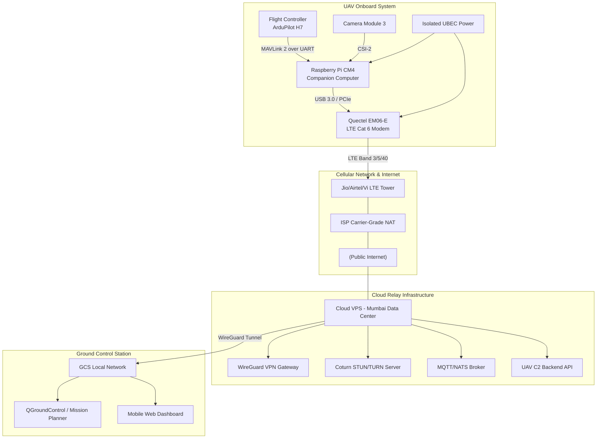
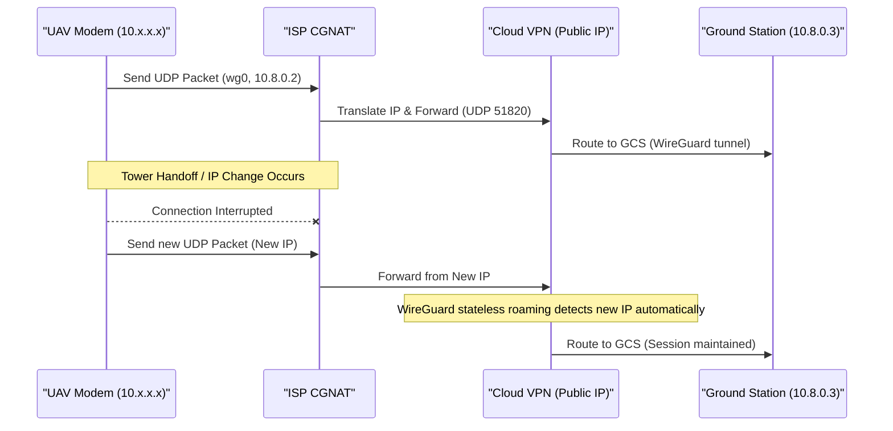
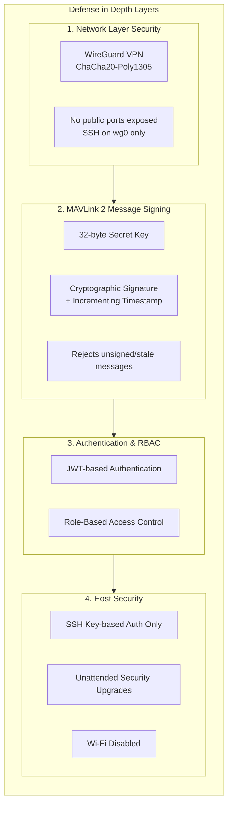

# Long-Range UAV 4G/LTE Communication & Control System

> ⚠️ **PROJECT ON HAULT — DEVELOPMENT SUSPENDED**
>
> This project is currently **on halt** and no longer under active development/research due to **financial constraints**. There is no funding available to continue hardware procurement, cloud infrastructure, or ongoing engineering work. The repository is preserved as-is for reference and educational purposes, but **issues, pull requests, and support requests will not be addressed** until funding is secured or the project is revived.
>
> No further code changes, releases, or maintenance updates are expected at this time.

A robust, long-range Unmanned Aerial Vehicle (UAV) communication and control system designed for Beyond Visual Line of Sight (BVLOS) operations over 4G/LTE cellular networks. Built for challenging environments where Carrier-Grade NAT (CGNAT), variable latency (40–500 ms), and signal degradation are common.

---

## Table of Contents

- [Overview](#overview)
- [Architecture Summary](#architecture-summary)
- [Key Features](#key-features)
- [Hardware Requirements](#hardware-requirements)
- [Software Stack](#software-stack)
- [Network & NAT Traversal](#network--nat-traversal)
- [Protocol Selection](#protocol-selection)
- [Security](#security)
- [Failsafe & Recovery](#failsafe--recovery)
- [Bandwidth & Latency](#bandwidth--latency)
- [Deployment](#deployment)
- [Production/Fleet Scale](#productionfleet-scale)
- [Documentation](#documentation)
- [License](#license)

---

## Overview

This project implements a distributed intelligence UAV architecture split across three primary nodes:

1. **UAV Onboard Stack** — Pixhawk H7 Flight Controller (ArduPilot) + Raspberry Pi CM4 Companion Computer
2. **Cloud Relay Infrastructure** — WireGuard VPN, STUN/TURN, MAVLink routing, telemetry broker
3. **Ground Control Station (GCS)** — QGroundControl / Mission Planner + custom web/mobile dashboard

The system treats the cellular network as fundamentally untrusted and highly volatile, abstracting network volatility from flight-critical functions.

---

## Architecture Summary

See [`architecture-diagram.md`](./architecture-diagram.md) for the full detailed system diagram with all components, data flows, and failsafe logic.

---

## Key Features

- **CGNAT Bypass** — Outbound WireGuard VPN tunnel from UAV to cloud VPS
- **Sub-250 ms Video Latency** — WebRTC with hardware H.264 encoding (v4l2h264enc)
- **Secure C2** — MAVLink 2 Message Signing with cryptographic authentication
- **Failsafe Autonomy** — Flight controller retains ultimate authority; automatic RTL on link loss
- **Adaptive Bitrate** — WebRTC GCC adjusts video quality based on network conditions
- **Hardware Isolation** — Dedicated power rails for modem; isolated UBEC for avionics
- **Process Isolation** — systemd-managed services prevent video pipeline crashes from affecting telemetry
- **Fleet Scalability** — Designed to scale from prototype to distributed fleet via Kubernetes, NATS, and WebRTC SFUs

---

## Hardware Requirements

> **Note:** The hardware specifications listed below are recommendations based on the current design. These may be changed later as per requirement, depending on mission needs, budget constraints, or availability of newer components.

### Flight Controller
- **Pixhawk H7** (e.g., Cube Orange+ or Pixhawk 6C)
- **ArduPilot** firmware (preferred over PX4 for advanced failsafes and Lua scripting)
- Triple-redundant, temperature-controlled IMUs

### Companion Computer
- **Raspberry Pi Compute Module 4** (4GB RAM, 32GB eMMC, no Wi-Fi)
- Industrial carrier board with M.2 Key-B slot, JST-GH connectors
- Raspberry Pi OS Lite 64-bit (minimal, headless)

### Camera
- **Raspberry Pi Camera Module 3** (MIPI CSI-2)
- Hardware H.264 encoding via CM4's V4L2 M2M encoder

### 4G/LTE Modem
- **Quectel EM06-E** (LTE Cat 6, M.2 Key-B)
- Supports Carrier Aggregation for improved urban throughput
- Dedicated 3.3V buck converter (4A continuous, low-ESR capacitance)

### Power
- **Isolated UBEC** drawing from 4S–12S flight battery
- Separate power rail for modem to prevent brownouts
- Common ground with CM4, isolated from FC power rails

---

## Software Stack

### Onboard Services (systemd-managed)

| Service | Description |
|---------|-------------|
| **WireGuard** | VPN tunnel (wg0, 10.8.0.2) — starts before network-dependent apps |
| **mavlink-router** | C++ MAVLink 2 router — UART input, multiple UDP endpoints |
| **MAVSDK Agent** | C++/Rust gRPC API — translates cloud commands to MAVLink |
| **WebRTC Video Daemon** | GStreamer pipeline (libcamerasrc → v4l2h264enc → WebRTC) |
| **Telegraf** | System metrics (CPU, temp, LTE signal) → local MQTT broker |
| **Watchdog** | Health monitor — AT reset for modem on 30s ping failure |

### Cloud Infrastructure

| Component | Technology |
|-----------|------------|
| **VPN Gateway** | WireGuard (kernel-space, UDP 51820) |
| **STUN/TURN** | Coturn (for WebRTC NAT traversal) |
| **Telemetry Broker** | MQTT / NATS |
| **C2 Backend API** | FastAPI (Python) or Go — JWT + RBAC |
| **Database** | PostgreSQL (audit log), TimescaleDB (metrics) |
| **Monitoring** | Grafana dashboards |

### Ground Station

| Component | Technology |
|-----------|------------|
| **Professional GCS** | QGroundControl or Mission Planner (UDP 14550) |
| **Web Dashboard** | React / Next.js with WebRTC video + WebSocket telemetry |
| **Telemetry Bridge** | mavlink2rest (MAVLink → JSON) |

---

## Network & NAT Traversal

### The CGNAT Problem
Indian mobile operators (Jio, Airtel, Vi) use CGNAT, assigning private IPs (10.x.x.x) to modems. Direct inbound connections are impossible.

### Solution: Outbound WireGuard
- UAV initiates **outbound** UDP connection to cloud VPS on port 51820
- `PersistentKeepalive=25s` keeps CGNAT translation tables open
- WireGuard's **stateless roaming** handles tower handoffs and IP changes seamlessly
- GCS connects to the same VPS via WireGuard, creating a flat encrypted subnet (10.8.0.x)

---

## Protocol Selection

| Communication Path | Protocol | Justification |
|---|---|---|
| FC → Raspberry Pi | MAVLink 2 (UART, 921600 baud) | Minimal overhead, hardware predictability, MAVLink 2 signing support |
| Raspberry Pi → Cloud VPS | WireGuard (UDP) | Kernel-space, low CPU, seamless roaming, no TCP HOL blocking |
| Telemetry (Network) | MAVLink 2 over UDP | No retransmission delays; stale packets are naturally superseded |
| Video Streaming | WebRTC (UDP/SRTP) | Sub-250 ms latency, adaptive bitrate, FEC, congestion control |
| Application C2 | MAVSDK (gRPC/C++) | Abstracts raw MAVLink; robust async API |
| Hardware Monitoring | MQTT (TCP, QoS 1) | Guaranteed delivery for non-latency-critical metrics |
| Configuration | SSH over WireGuard | Secure maintenance without exposing public ports |
| Emergency/Failsafe | MAVLink 2 COMMAND_LONG | Cryptographically authenticated, high priority |

**QUIC** was considered but rejected due to TLS handshake complexity on embedded systems. **WebSockets** are used only between the cloud API and web dashboard, not over the cellular link.

---

## Security

Defense-in-depth with four layers:

1. **Network Layer** — All traffic encrypted via WireGuard (ChaCha20-Poly1305); no public ports exposed; SSH listens on wg0 only
2. **MAVLink 2 Message Signing** — 32-byte secret key flashed to FC; every command includes cryptographic signature + incrementing timestamp; rejects unsigned and replayed messages
3. **Authentication & RBAC** — JWT-based auth; roles: *Observers* (read-only) and *Pilots* (command authority)
4. **Host Security** — SSH key-based auth only; unattended security upgrades; Wi-Fi disabled to reduce interference

---

## Failsafe & Recovery

| Failure Mode | Detection | Fallback | Recovery |
|---|---|---|---|
| Loss of 4G Connectivity | FC: missing GCS heartbeats > 3s | FC enters LOITER, then RTL after 10s | VPN reconnects when cellular returns |
| High Latency/Jitter | WebRTC GCC / MAVLink ping RTT | Video bitrate degrades (3 Mbps → 500 Kbps) | Bitrate scales up as RSRP/RSRQ improve |
| Raspberry Pi Crash | FC: loss of UART traffic | FC enters RTL; RPi watchdog reboots | RPi boots, establishes VPN, resumes routing |
| LTE Modem Crash | Watchdog: ping failure > 30s | AT reset command to modem | Modem re-registers on cellular network |
| Power Brownout | FC voltage sensors / RPi dmesg | FC initiates immediate LAND | Operator investigates hardware |
| Video Pipeline Failure | systemd: process crash | systemd auto-restart (Restart=always) | Daemon re-initializes libcamera |
| GPS Failure/Jamming | FC EKF variance / satellite lock | Dead reckoning / optical flow / altitude hold | Operator uses video feed to assess |
| Cloud Server Outage | VPN tunnel collapse | Continue to last waypoint, then RTL | Redundant cloud servers (fleet scale) |

---

## Bandwidth & Latency

### Bandwidth Consumption

| Component | Uplink |
|---|---|
| Video (Adaptive) | 500 Kbps – 3 Mbps |
| Telemetry (Downlink) | ~20 Kbps |
| Command (Uplink) | < 5 Kbps |
| Monitoring/VPN Overhead | ~10 Kbps |
| **Total Uplink** | **1.5 – 3.5 Mbps** |

LTE Cat 6 in India can sustain 10–25 Mbps uplink nominally, providing ample headroom.

### Latency Budget (Ideal Conditions)

| Stage | Latency |
|---|---|
| Camera Capture to HW Encode | 15 ms |
| WebRTC Packetization & Encryption | 5 ms |
| 4G Radio Air Interface (average) | 40 – 120 ms |
| Cloud VPS Routing & TURN | 10 ms |
| GCS Download & Decode | 20 ms |
| **Total Glass-to-Glass** | **90 – 170 ms** |

---

## Production/Fleet Scale

- **Cloud**: Kubernetes cluster with scalable WebRTC SFUs (LiveKit / MediaMTX)
- **Device Management**: NetBird or Tailscale for automated key rotation
- **OTA Updates**: ostree or Mender.io with atomic rollback
- **Data Lake**: Managed cloud warehouse for predictive maintenance
- **Fleet Telemetry**: mavlink-router → centralized NATS broker for global geofencing

---

## Documentation

- **[Long-Range UAV HLD](./Long-Range-UAV-HLD.md)** — High-level design document with full architectural rationale
- **[Architecture Diagram](./architecture-diagram.md)** — Detailed Mermaid diagrams of all system components, data flows, and failsafe logic

---

## License

This project is provided for reference and educational purposes. Hardware and software components are subject to their respective licenses.

### Non-Commercial Use

This project is licensed under the **Creative Commons Attribution-NonCommercial 4.0 International (CC BY-NC 4.0)**. You are free to share and adapt the material for non-commercial purposes, provided you give appropriate credit. Commercial use, including but not limited to selling, licensing, or otherwise exploiting the material for commercial advantage, is strictly prohibited without prior written permission from the project authors.

For commercial licensing inquiries, please contact the project maintainers.
