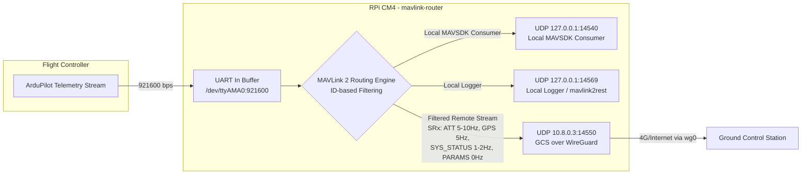
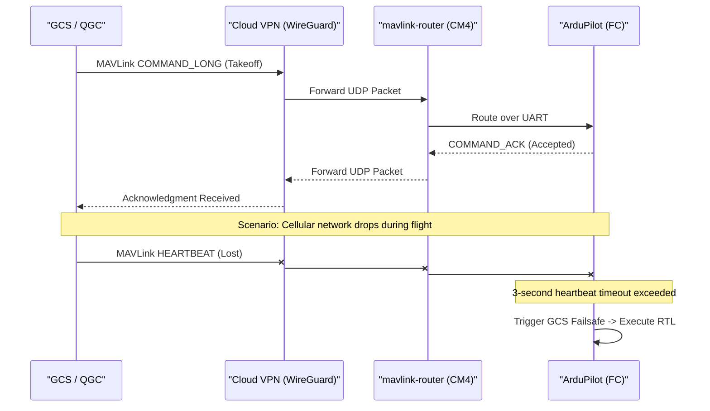
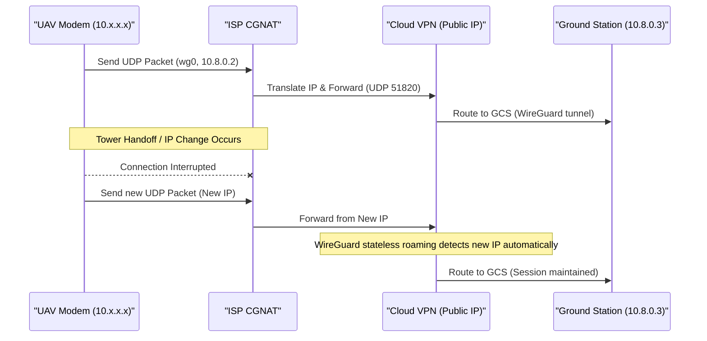
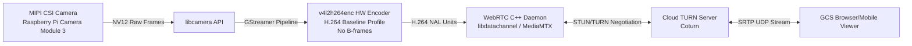
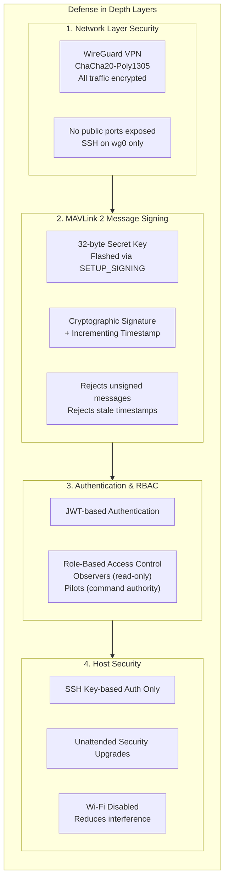
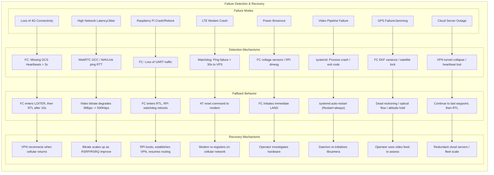

# **UAV 4G Control Architecture — System Diagram**

This document contains a comprehensive Mermaid diagram visualizing the entire long-range UAV communication and control system over 4G/LTE cellular networks, including CGNAT traversal, WireGuard VPN, MAVLink routing, WebRTC video streaming, and failsafe mechanisms.

## **Complete System Architecture Diagram**

```mermaid
graph TD
    %% ==================== UAV ONBOARD SYSTEM ====================
    subgraph UAV["UAV Onboard System"]
        direction TB

        subgraph FlightController["Flight Controller (Pixhawk H7)"]
            FC["ArduPilot H7<br/>Cube Orange+"]
            IMU["Triple-Redundant IMU"]
            Baro["Barometer"]
            FC --> IMU
            FC --> Baro
        end

        subgraph CompanionComputer["Companion Computer (Raspberry Pi CM4)"]
            direction TB
            RPi["Raspberry Pi CM4<br/>4GB RAM, 32GB eMMC<br/>Raspberry Pi OS Lite 64-bit"]
            Camera["Camera Module 3<br/>MIPI CSI-2"]
            Modem["Quectel EM06-E<br/>LTE Cat 6 Modem<br/>M.2 Key-B"]
            BuckConv["Buck Converter<br/>4A @ 3.3V"]
            UBEC["Isolated UBEC<br/>from Flight Battery"]

            RPi --> Camera
            RPi --> Modem
            UBEC --> BuckConv
            BuckConv --> Modem
            UBEC --> RPi
        end

        subgraph SystemdServices["systemd Managed Services"]
            WG["WireGuard Interface<br/>wg0 (10.8.0.2)"]
            MavRouter["mavlink-router<br/>UART + UDP Endpoints"]
            MavSDK["MAVSDK Control Agent<br/>gRPC API"]
            VideoDaemon["WebRTC Video Daemon<br/>GStreamer + v4l2h264enc"]
            Telegraf["Telegraf Agent<br/>System Metrics"]
            Watchdog["Health Watchdog<br/>Modem Reset Logic"]
            SSH["SSH Daemon<br/>wg0 only"]

            WG --> MavRouter
            MavRouter --> MavSDK
            MavRouter --> VideoDaemon
            VideoDaemon --> WG
            Telegraf --> WG
            Watchdog --> Modem
            SSH --> WG
        end

        %% Internal connections
        FC -- "MAVLink 2<br/>UART 921600bps" --> RPi
        RPi --> SystemdServices
    end

    %% ==================== CELLULAR NETWORK ====================
    subgraph CellularNetwork["Cellular Network & Internet"]
        direction TB
        CellTower["LTE Tower<br/>Jio / Airtel / Vi<br/>Bands 3/5/40"]
        CGNAT["Carrier-Grade NAT<br/>Private IP (10.x.x.x)"]
        InternetCloud["Public Internet"]

        Modem -- "LTE Cat 6<br/>Carrier Aggregation" --> CellTower
        CellTower --> CGNAT
        CGNAT --> InternetCloud
    end

    %% ==================== CLOUD RELAY INFRASTRUCTURE ====================
    subgraph CloudRelay["Cloud Relay Infrastructure<br/>Mumbai Data Center"]
        direction TB
        CloudVPS["Cloud VPS<br/>Ubuntu 22.04 LTS"]
        WGServer["WireGuard VPN Gateway<br/>UDP 51820"]
        Coturn["Coturn STUN/TURN Server<br/>WebRTC NAT Traversal"]
        TelemetryBroker["MQTT/NATS Broker<br/>Telemetry Aggregation"]
        APIServer["UAV C2 Backend API<br/>FastAPI / Go<br/>JWT + RBAC"]
        DB["PostgreSQL<br/>Audit Log"]
        Grafana["Grafana Dashboard<br/>TimescaleDB"]

        CloudVPS --> WGServer
        CloudVPS --> Coturn
        CloudVPS --> TelemetryBroker
        CloudVPS --> APIServer
        APIServer --> DB
        TelemetryBroker --> Grafana
    end

    %% ==================== GROUND CONTROL STATION ====================
    subgraph GCS["Ground Control Station"]
        direction TB
        GCSLaptop["Ruggedized Laptop<br/>WireGuard Client"]
        QGC["QGroundControl<br/>UDP 14550"]
        MobileApp["Mobile Web Dashboard<br/>React / Next.js"]
        BrowserViewer["Browser WebRTC Viewer"]

        GCSLaptop --> QGC
        GCSLaptop --> MobileApp
        MobileApp --> BrowserViewer
    end

    %% ==================== INTER-SYSTEM CONNECTIONS ====================
    %% UAV to Cellular
    Modem -- "4G/LTE Uplink<br/>1.5-3.5 Mbps" --> CellTower

    %% Cellular to Cloud (VPN tunnel)
    InternetCloud -- "WireGuard Tunnel<br/>Outbound UDP 51820<br/>PersistentKeepalive=25s" --> CloudVPS

    %% Cloud to GCS (VPN tunnel)
    CloudVPS -- "WireGuard Tunnel<br/>10.8.0.3" --> GCSLaptop

    %% WebRTC video path
    VideoDaemon -- "WebRTC SRTP<br/>STUN/TURN via Coturn" --> Coturn
    Coturn -- "SRTP UDP Stream" --> BrowserViewer

    %% Telemetry path
    MavRouter -- "Filtered MAVLink 2<br/>UDP 14550" --> QGC

    %% MQTT monitoring path
    Telegraf -- "MQTT QoS 1<br/>Buffered on reconnect" --> TelemetryBroker

    %% gRPC C2 path
    APIServer -- "gRPC / MAVSDK" --> MavSDK

    %% SSH management path
    SSH -- "SSH over WireGuard<br/>Key-based Auth" --> CloudVPS

    %% ==================== FAILSAFE LOGIC ====================
    subgraph FailsafeLogic["Failsafe & Recovery Logic"]
        direction LR
        HeartbeatLoss["FC Heartbeat Timeout<br/>> 3s"]
        NetworkDrop["Cellular Outage<br/>Ping > 30s"]
        RPiCrash["RPi Crash/Reboot<br/>UART Loss"]
        ModemCrash["Modem Hang<br/>AT Reset"]
        VideoCrash["Video Pipeline Crash<br/>systemd Restart"]

        HeartbeatLoss --> FC
        NetworkDrop --> Watchdog
        RPiCrash --> FC
        ModemCrash --> Modem
        VideoCrash --> VideoDaemon
    end

    %% ==================== LATENCY BUDGET ====================
    subgraph LatencyBudget["Latency Budget (Ideal Conditions)"]
        direction TB
        L1["Camera Capture to HW Encode: 15ms"]
        L2["WebRTC Packetization & Encryption: 5ms"]
        L3["4G Radio Air Interface: 40-120ms"]
        L4["Cloud VPS Routing: 10ms"]
        L5["GCS Download & Decode: 20ms"]
        LTotal["Total Glass-to-Glass: 90-170ms"]

        L1 --> L2 --> L3 --> L4 --> L5 --> LTotal
    end

    %% ==================== BANDWIDTH ESTIMATES ====================
    subgraph BandwidthEstimates["Bandwidth Estimates"]
        direction TB
        B1["Video (Adaptive): 500Kbps - 3Mbps"]
        B2["Telemetry (Downlink): ~20Kbps"]
        B3["Command (Uplink): <5Kbps"]
        B4["Monitoring/VPN Overhead: ~10Kbps"]
        BTotal["Total Uplink: 1.5-3.5Mbps"]

        B1 --> B2 --> B3 --> B4 --> BTotal
    end
end
```

## **MAVLink Routing Detail**



## **Command and Control Sequence**



## **Network & NAT Traversal Sequence**



## **Video Streaming Pipeline**



## **Security Architecture**



## **Failure and Failsafe Matrix**


